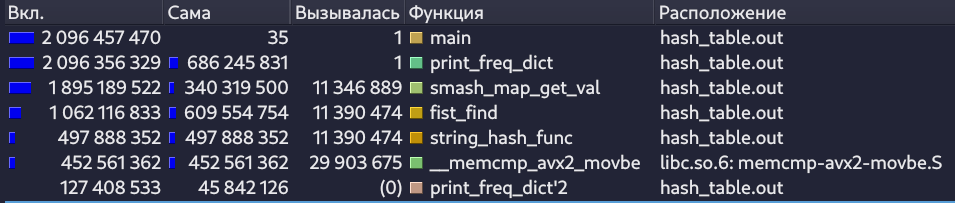
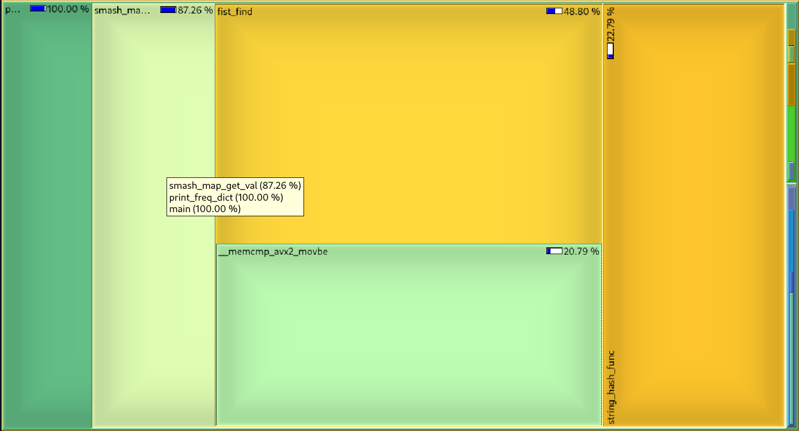

---
author:
- Швабра Владимир Сергеевич, Б01-411
title: |
  Оптимизации ассоциативной хэш-таблицы
---

# Хэш-таблица

## Аннотация

В данном проекте реализована ассоциативная хеш-таблица. На её примере изучаются возможности профилирования при помощи `valgrind` и последующей оптимизации кода написанием ассемблерных частей.

### Цели работы  
1. Написать ассоциативную хеш-таблицу, на основе которой сделать тест, составляющий частотный словарь входных текстовых файлов
2. Найти горячии функции инструментами профилирования и оптимизировать их, написанием кода на ассемблере.

## Сборка

Для работы программы нужно установить следующие зависимости:

| Название     | Версия   | Для чего нужно                          |
|--------------|----------|-----------------------------------------|
| GCC          | 14.2.1   | Для сборки проекта                      |
| GNU Make     | 4.4.1    | Для управления сборкой проекта          |
| Graphviz     | 12.1.0   | Для отрисовки графических дампов        |
| Valgrind     | 3.24.0   | Для профилирования кода                 |
| kcachegrind  | 24.12.3  | Для графического отображения профиля    |
| cpupower     | 6.13.8   | Для установки стационарной частоты CPU  |

## Системные характеристики

### ОС
- **ОС**: Fedora Linux 41 (Workstation Edition)
- **Ядро**: Linux 6.13.8-200.fc41.x86_64
- **Окружение рабочего стола**: GNOME Classic
- **Оконный менеджер**: Mutter (Wayland)
- **Тема**: [Tokyonight-Dark-Moon [GTK2/3/4]](https://github.com/tokyo-night/tokyo-night-vscode-theme "Всем советую")
- **Шрифт**: Cantarell (11pt) [GTK2/3/4]

### Аппаратное обеспечение
- **Процессор**: Intel(R) Core(TM) i5-1035G1 (8 ядер)
- **Графика**: Intel Iris Plus Graphics G1 (Ice Lake)
- **Память**: 7.44 GiB
- **Swap**: 7.44 GiB
- **Диск**: 112.62 GiB
- **Дисплей (CMN1415)**: 1920x1080 @ 60 Hz

## Написание исходной версии

Реализуемая хеш-таблица будет с открытой адресацией и с решением коллизий цепочечным методом. Её основной частью будет массив `buckets`, каждым элементом которого будет 2 двусвязных списка (ключи и значения), реализованных на массиве. Такой список быстрее версии на указателях, благодаря одноразовому выделению и освобождению памяти и кеш-дружественной архитектуре. Подробнее о реализации и функционале испольуемого списка читать [тут](https://github.com/kzueirf12345/list_on_array).

В качестве хеш-функции для начала реализуем полиномиальный хэш (Polynomial Rolling Hash), как самый простой и распространённый алгоритм.

<details>
<summary><b>Используемая версия полиномиальной хеш-функции</b></summary>

```c
size_t string_hash_func(const void* const string)
{
    lassert(!is_invalid_ptr(string), "");

    size_t hash_result = 0;
    for (const char* it = (const char*)string; *it; ++it)
    {
        hash_result = HASH_KEY * hash_result + (size_t)*it;
    }
    return hash_result;
}
```

> Данная реализация основана на переполнении. Для получения итогового индекса будет браться остаток от деления на размер массива `buckets`, который логично сделать большим простым числом

</details>


### Функции

#### `smash_map_insert` 
- Вычисляет индекс bucket-а переданного элемента в хеш-таблице через хеш-функцию.
- Ищет ключ в bucket-е через `fist_find`.
  - Если ключ не найден: добавляет ключ и значение в соответствующие массивы через `fist_push`.
  - Если ключ найден: обновляет существующее значение через `memcpy`.

#### `smash_map_get_val`
- Вычисляет индекс bucket-а через хеш-функцию.
- Ищет ключ в bucket-е через `fist_find`.
  - Если ключ не найден: возвращает `NULL`.
  - Если ключ найден:
    - Вычисляет адрес значения по формуле: `data + index * elem_size`.
    - Возвращает указатель на найденное значение.

#### `smash_map_print`
Выводит содержимое хеш-таблицы в указанный файл в формате.
```
'key1': 'val1'
'key2': 'val2'
...
'keyn': 'valn'
```

#### `smash_map_dumb`
Выводит в дамп-файл информацию о структуре хеш-таблицы и для кадого листа вызывает `fist_dumb`. Также выводит текстовый дамп в консоль.


#### `smash_map_verify`
> В release версии ничего не делает
- Проверяет валидность значений структуры хэш-таблицы.
- Для каждого списка вызывает соответствующий верификатор `fist_verify`.
- Проходится по всем элементам хэш-таблицы и проверяет, что нет дубликатов внутренним проходом.


## Оптимизация

### Метод профилирования

Для сбора данных о выполнении программы мы будем использовать утилиту `valgrind`. Для отображения сгенерированных данных воспользуемся `kcachegrind`. Для удобства допишем необходимый функционал в Makefile

<details>
<summary><b>Make для профилирования</b></summary>

```makefile
OPTS ?= -i 3 \
		./assets/wap.txt ./assets/wap_out.txt \
		./assets/potter.txt ./assets/potter_out.txt \
		./assets/lorem.txt ./assets/lorem_out.txt

check_leaks: build
	make rebuild ADD_OPTS="-g" DEBUG_=0 ;
	valgrind --leak-check=full --show-leak-kinds=all ./$(PROJECT_NAME).out $(OPTS)

PROFILE_NUM ?= 1

profile:
	make set_freq ;
	make rebuild ADD_OPTS="-g" DEBUG_=0 ;
	valgrind --tool=callgrind --callgrind-out-file=profile$(PROFILE_NUM).out --dump-instr=yes ./$(PROJECT_NAME).out $(OPTS) ;
	kcachegrind profile$(PROFILE_NUM).out ;
	make reset_freq 

set_freq:
	sudo cpupower frequency-set --max 2.4GHz ;
	sudo cpupower frequency-set --min 2.4GHz

reset_freq:
	sudo cpupower frequency-set --max 4GHz ;
	sudo cpupower frequency-set --min 0.1GHz
```

</details>

Исходя из того, какая функция является самой горячей, будем изменять её код, а после оценивать прирост производительности.

Чтобы анализировать только нужный участок, в котором мы непосредственно работаем с хэш-таблицей, нужно сказать об этом verilog-у. Поэтому оградим нужную часть кода соответствующими макросами.

<details>
<summary><b>Исследуемая часть кода</b></summary>

```c
#define SMASH_MAP_ERROR_HANDLE(call_func, ...)                                                      \
    do {                                                                                            \
        enum SmashMapError error_handler = call_func;                                               \
        if (error_handler)                                                                          \
        {                                                                                           \
            fprintf(stderr, "Can't " #call_func". Error: %s\n",                                     \
                            smash_map_strerror(error_handler));                                     \
            __VA_ARGS__                                                                             \
            return error_handler;                                                                   \
        }                                                                                           \
    } while(0)

enum SmashMapError print_freq_dict(const char* const input_filename, 
                                   const char* const output_filename)
{
/* инициализация text 
...
*/
smash_map_t map = {};
SMASH_MAP_ERROR_HANDLE(
    SMASH_MAP_CTOR(
        &map,                 // указатель на структуру
        MAP_SIZE,             // размер `buckets` = 10007
        MAX_WORD_SIZE,        // размер ключа = 64
        sizeof(size_t),       // размер значения
        string_hash_func,     // hash-функция
        smash_map_key_to_str, // функция вывода в строку ключа (для дампа)
        smash_map_val_to_str  // функция вывода в строку значения (для дампа)
    ),
    munmap(text, text_size);
);

CALLGRIND_START_INSTRUMENTATION; // НАЧАЛО ИССЛЕДУЕМОГО БЛОКА

char   key_buffer[MAX_WORD_SIZE] = {};
size_t key_buffer_counter        = 0;
for (size_t chr_ind = 0; chr_ind < text_size; ++chr_ind)
{
    const char chr = text[chr_ind];
    if (isalpha(chr))
    {
        IF_DEBUG(
            if (key_buffer_counter >= MAX_WORD_SIZE)
            {
                fprintf(stderr, "Founded word with size more then max valid\n");
                smash_map_dtor(&map);
                munmap(text, text_size);
                return SMASH_MAP_ERROR_UNKNOWN;
            }
        )
        key_buffer[key_buffer_counter++] = chr;
    }
    else
    {
        if (!key_buffer_counter)
        {
            continue;
        }

        size_t* val = smash_map_get_val(&map, key_buffer);
        if (val)
        {
            ++*val;
        }
        else
        {
            size_t temp_val = 1;
            SMASH_MAP_ERROR_HANDLE(
                smash_map_insert(&map, (smash_map_elem_t){.key = key_buffer, .val = &temp_val}),
                smash_map_dtor(&map);
                munmap(text, text_size);
            );
        }

        key_buffer_counter = 0;
        if (!memset(key_buffer, 0, MAX_WORD_SIZE))
        {
            perror("Can't memset key_buffer");
            return SMASH_MAP_ERROR_STANDARD_ERRNO;
        }
        
    }
}

CALLGRIND_STOP_INSTRUMENTATION; // КОНЕЦ ИССЛЕДУЕМОГО БЛОКА
/* вывод в файл и деструкторы
...
*/
}
```

</details>

### Набор данных

Тестовыми данными, на которых мы будем проверять произоводительность являются 3 текстовых файла.

- `wap.txt` - "Война и мир" на английском языке, скопированная несколько раз до 1 миллиона строк. 8809226 слов.
- `potter.txt` - Все части (которые смог найти) "Гарри Поттера" на английском языке, скопированная несколько раз до 100 000 строк. 1763920 слов.
- `lorem.txt` - Стандартный бессмысленный текст из ограниченного набора английских слов, размером 100 000 строк. 600393 слов.

Текста выбраны по приколу. Размер подбирался так, чтобы время работы программы было достаточным, чтобы погрешность измерений, обусловленная небольшим изменением частоты процессора во время выполнения (хоть мы её и зафиксировали, она всё равно немного меняется), не влияла на результат. Время выполнения release версии примерно 5 секунд (с флагом -g для предоставления информации профилировщику).

### Неоптимизированная версия

Проведём профилирование вызвав `make profile`.





**Общее время выполнения** - $2 096 \pm 1 * 10^6$ тактов

Самая горячяя функция - `smash_map_get_val`, в которой чуть меньше половины времени занимает поиск элемента в списке. Значит будем сконцетрируемся на её оптимизации.

# ЖДИТЕ ОБНОВУ