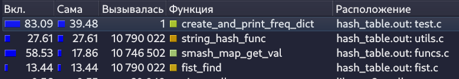
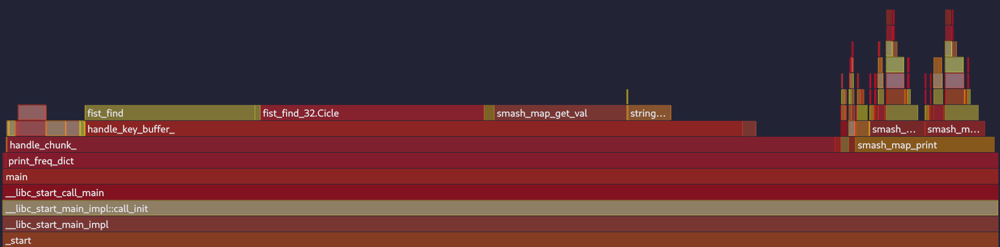

---
author:
- Швабра Владимир Сергеевич, Б01-411
title: |
  Оптимизации ассоциативной хэш-таблицы
---

# Хэш-таблица

## Аннотация

В данном проекте реализована ассоциативная хеш-таблица. На её примере изучаются возможности профилирования при помощи `valgrind` и последующей оптимизации кода написанием ассемблерных частей.

### Цели работы  
1. Написать ассоциативную хеш-таблицу, на основе которой сделать тест, составляющий частотный словарь входных текстовых файлов
2. Найти горячие функции инструментами профилирования и оптимизировать их, написанием кода на ассемблере.

### Примечание
В данной работе будет рассматриваться оптимизация именно СОЗДАНИЯ частотного словаря, а не поиска в нём слов после создания. Данная часть полностью охватывает написанный функционал хэш-таблицы. Такой выбор сделан, потому что проект является учебным, и, как будет выявленно далее, позволяет наиболее широко охватить область применения ассемблерных оптимизаций и лучше разобраться в их написании.

## Сборка

Для работы программы нужно установить следующие зависимости:

| Название     | Версия   | Для чего нужно                                  |
|--------------|----------|-------------------------------------------------|
| GCC          | 14.2.1   | Для C                                           |
| NASM         | 2.16.03  | Для ассемблера                                  |
| GNU Make     | 4.4.1    | Для управления сборкой проекта                  |
| Graphviz     | 12.1.0   | Для отрисовки графических дампов                |
| Valgrind     | 3.24.0   | Для профилирования кода                         |
| kcachegrind  | 24.12.3  | Для графического отображения профиля Valgrind   |
| perf         | 6.13.10  | Для профилирования кода                         |
| hotspot      | 1.5.80   | Для графического отображения профиля perf       |
| cpupower     | 6.13.8   | Для установки стационарной частоты CPU          |

## Системные характеристики

### ОС
- **ОС**: Fedora Linux 41 (Workstation Edition)
- **Ядро**: Linux 6.13.8-200.fc41.x86_64
- **Окружение рабочего стола**: GNOME Classic
- **Оконный менеджер**: Mutter (Wayland)
- **Тема**: [Tokyonight-Dark-Moon [GTK2/3/4]](https://github.com/tokyo-night/tokyo-night-vscode-theme "Всем советую")
- **Шрифт**: Cantarell (11pt) [GTK2/3/4]

### Аппаратное обеспечение
- **Процессор**: Intel(R) Core(TM) i5-1035G1 (8 ядер)
- **Графика**: Intel Iris Plus Graphics G1 (Ice Lake)
- **Память**: 7.44 GiB
- **Swap**: 7.44 GiB
- **Диск**: 112.62 GiB
- **Дисплей (CMN1415)**: 1920x1080 @ 60 Hz

## Написание исходной версии

Реализуемая хеш-таблица будет с открытой адресацией и с методом цепочек для разрешения коллизий. Её основной частью будет массив `buckets`, каждым элементом которого будет 2 двусвязных списка (ключи и значения), реализованных на массиве. Такая реализация быстрее версии на указателях, благодаря одноразовому выделению и освобождению памяти и кеш-дружественной архитектуре. Подробнее о реализации и функционале используемого списка читать [тут](https://github.com/kzueirf12345/list_on_array).

В качестве хеш-функции для начала реализуем полиномиальный хэш (Polynomial Rolling Hash), как самый простой и распространённый алгоритм.

<details>
<summary><b>Используемая версия полиномиальной хеш-функции</b></summary>

```c
size_t string_hash_func(const void* const string)
{
    lassert(!is_invalid_ptr(string), "");

    size_t hash_result = 0;
    for (const char* it = (const char*)string; *it; ++it)
    {
        hash_result = HASH_KEY * hash_result + (size_t)*it;
    }
    return hash_result;
}
```

> Данная реализация основана на переполнении. Для получения итогового индекса берётся остаток от деления на размер массива `buckets`, который логично сделать большим простым числом

</details>


### Функции

#### `smash_map_insert` 
- Вычисляет индекс bucket-а переданного элемента в хеш-таблице через хеш-функцию.
- Ищет ключ в bucket-е через `fist_find`.
  - Если ключ не найден: добавляет ключ и значение в соответствующие массивы через `fist_push`.
  - Если ключ найден: обновляет существующее значение через `memcpy`.

#### `smash_map_get_val`
- Вычисляет индекс bucket-а через хеш-функцию.
- Ищет ключ в bucket-е через `fist_find`.
  - Если ключ не найден: возвращает `NULL`.
  - Если ключ найден:
    - Вычисляет адрес значения по формуле: `data + index * elem_size`.
    - Возвращает указатель на найденное значение.

#### `smash_map_print`
Выводит содержимое хеш-таблицы в указанный файл в формате.
```
'key1': 'val1'
'key2': 'val2'
...
'keyn': 'valn'
```

#### `smash_map_dumb`
Выводит в дамп-файл информацию о структуре хеш-таблицы и для каждого листа вызывает `fist_dumb`. Также выводит текстовый дамп в консоль.


#### `smash_map_verify`
> В release версии ничего не делает
- Проверяет валидность значений структуры хэш-таблицы.
- Для каждого списка вызывает соответствующий верификатор `fist_verify`.
- Проходится по всем элементам хэш-таблицы и проверяет, что нет дубликатов.


## Оптимизация

### Метод профилирования

Для сбора данных о выполнении программы мы будем использовать утилиту `valgrind`. Для отображения сгенерированных данных воспользуемся `kcachegrind`. Для удобства допишем необходимый функционал в Makefile

<details>
<summary><b>Make для профилирования</b></summary>

```makefile
OPTS ?= -i 3 \
		./assets/wap.txt ./assets/wap_out.txt \
		./assets/potter.txt ./assets/potter_out.txt \
		./assets/lorem.txt ./assets/lorem_out.txt

check_leaks: build
	make rebuild ADD_OPTS="-g" DEBUG_=0 ;
	valgrind --leak-check=full --show-leak-kinds=all ./$(PROJECT_NAME).out $(OPTS)

PROFILE_NUM ?= 1

profile:
	make set_freq ;
	make rebuild ADD_OPTS="-g" DEBUG_=0 ;
	valgrind --tool=callgrind --callgrind-out-file=profile$(PROFILE_NUM).out --dump-instr=yes ./$(PROJECT_NAME).out $(OPTS) ;
	kcachegrind profile$(PROFILE_NUM).out ;
	make reset_freq 

set_freq:
	sudo cpupower frequency-set --max 2.4GHz ;
	sudo cpupower frequency-set --min 2.4GHz

reset_freq:
	sudo cpupower frequency-set --max 4GHz ;
	sudo cpupower frequency-set --min 0.1GHz
```

</details>

Исходя из того, какая функция является самой горячей, будем изменять её код, а после оценивать прирост производительности.

Чтобы анализировать только нужный участок, в котором мы непосредственно работаем с хэш-таблицей, нужно сказать об этом valgrind-у. Поэтому выделим нужную часть кода соответствующими макросами.

<details>
<summary><b>Исследуемая часть кода</b></summary>

```c
#define SMASH_MAP_ERROR_HANDLE(call_func, ...)                                                      \
    do {                                                                                            \
        enum SmashMapError error_handler = call_func;                                               \
        if (error_handler)                                                                          \
        {                                                                                           \
            fprintf(stderr, "Can't " #call_func". Error: %s\n",                                     \
                            smash_map_strerror(error_handler));                                     \
            __VA_ARGS__                                                                             \
            return error_handler;                                                                   \
        }                                                                                           \
    } while(0)

enum SmashMapError print_freq_dict(const char* const input_filename, 
                                   const char* const output_filename)
{
/* инициализация text 
...
*/
smash_map_t map = {};
SMASH_MAP_ERROR_HANDLE(
    SMASH_MAP_CTOR(
        &map,                 // указатель на структуру
        MAP_SIZE,             // размер `buckets` = 10007
        MAX_WORD_SIZE,        // размер ключа = 32
        sizeof(size_t),       // размер значения
        string_hash_func,     // hash-функция
        smash_map_key_to_str, // функция вывода в строку ключа (для дампа)
        smash_map_val_to_str  // функция вывода в строку значения (для дампа)
    ),
    munmap(text, text_size);
);

CALLGRIND_START_INSTRUMENTATION; // НАЧАЛО ИССЛЕДУЕМОГО БЛОКА

char   key_buffer[MAX_WORD_SIZE] = {};
size_t key_buffer_counter        = 0;
for (size_t chr_ind = 0; chr_ind < text_size; ++chr_ind)
{
    const char chr = text[chr_ind];
    if (isalpha(chr))
    {
        IF_DEBUG(
            if (key_buffer_counter >= MAX_WORD_SIZE)
            {
                fprintf(stderr, "Founded word with size more then max valid\n");
                smash_map_dtor(&map);
                munmap(text, text_size);
                return SMASH_MAP_ERROR_UNKNOWN;
            }
        )
        key_buffer[key_buffer_counter++] = chr;
    }
    else
    {
        if (!key_buffer_counter)
        {
            continue;
        }

        size_t* val = smash_map_get_val(&map, key_buffer);
        if (val)
        {
            ++*val;
        }
        else
        {
            size_t temp_val = 1;
            SMASH_MAP_ERROR_HANDLE(
                smash_map_insert(&map, (smash_map_elem_t){.key = key_buffer, .val = &temp_val}),
                smash_map_dtor(&map);
                munmap(text, text_size);
            );
        }

        key_buffer_counter = 0;
        if (!memset(key_buffer, 0, MAX_WORD_SIZE))
        {
            perror("Can't memset key_buffer");
            return SMASH_MAP_ERROR_STANDARD_ERRNO;
        }
        
    }
}

CALLGRIND_STOP_INSTRUMENTATION; // КОНЕЦ ИССЛЕДУЕМОГО БЛОКА
/* вывод в файл и деструкторы
...
*/
}
```

</details>

### Набор данных

Тестовыми данными, на которых мы будем проверять производительность, являются 3 текстовых файла.

- `wap.txt` - "Война и мир" на английском языке, скопированная несколько раз до 1 миллиона строк. 8809226 слов.
- `potter.txt` - Все части (которые смог найти) "Гарри Поттера" на английском языке, скопированная несколько раз до 100 000 строк. 1763920 слов.
- `lorem.txt` - Стандартный бессмысленный текст из ограниченного набора английских слов, размером 100 000 строк. 600393 слов.

Тексты выбраны по приколу. Размер подбирался так, чтобы время работы программы было достаточным, чтобы погрешность измерений, обусловленная небольшим изменением частоты процессора во время выполнения (хоть мы её и зафиксировали, она всё равно немного меняется), не влияла на результат. Время выполнения release версии примерно 5 секунд (с флагом -g для предоставления информации профилировщику).

### Неоптимизированная версия

Проведём профилирование вызвав `make profile`.


**Общее время выполнения** - $(2 078 \pm 1) * 10^6$ тактов

Самая горячая функция - `smash_map_get_val`, в которой чуть меньше половины времени занимает поиск элемента в списке. Значит сосредоточимся на её оптимизации.

### Отдельная функция на ассемблере

Первым способом оптимизации выберем написание отдельного файла с конкретной функцией на ассемблере. Для ускорения `fist_find` напишем функцию `fist_find_32`, в которой будем считать, что размер элемента массива 32 байта (чего явно хватает для слова), чтобы использовать векторные инструкции.Таким образом мы избавимся от надобности выполнять `memcmp` каждый раз, а заменим это на соответствующую инструкцию сравнения битов.

Также не стоит забывать, что векторные инструкции работают только с выровненными данными, поэтому искомый элемент и массив листа должны быть выровнены. Поэтому при создании буферной строки элемента мы укажем `__attribute__((aligned(32)))`, а массив будем выделять не через `calloc` а через `aligned_alloc`.

<details>
<summary><b>Листинг `fist_find_32`</b></summary>

```nasm
section .text

global fist_find_32

;;; ---------------------------------------------
;;; Descript:   find list elem index, if elem_size == 32 bytes
;;; Entry:      rdi = addr elem
;;;             rsi = data
;;;             rdx = coust bytes data
;;; Exit:       rax = index finded elem (0 if not find)
;;; Destroy:    rcx, ymm0-2
;;; ---------------------------------------------
fist_find_32:
    test rdx, rdx                                           ; check to zero size
je .ExitFailure

    mov rcx, 32                                             ; rcx - counter
    vmovdqa ymm0, [rdi]                                     ; ymm0 - elem
.Cicle:
    vmovdqa ymm1, [rsi + rcx]                               ; ymm1 - elem in data
    vpcmpeqb ymm2, ymm0, ymm1                               ; ymm2 - result cmp elem and elem in data
    vpmovmskb eax, ymm2                                     ; eax - cmp mask
    cmp eax, 0xFFFFFFFF                                     ; check if all bytes match
je .ExitSuccess

    add rcx, 32                                             ; rcx - next ind
    cmp rcx, rdx                                            ; check to end data
jl .Cicle

.ExitFailure:
    xor rax, rax
    vzeroupper                                              ; for optimize sse instrs
    ret

.ExitSuccess:
    mov rax, rcx                                            ; rax - index finded elem
    shr rax, 5
    vzeroupper                                              ; for optimize sse instrs
    ret
```

</details>

Оценим рост производительности.



**Общее время выполнения** - $(1 561 \pm 1) * 10^6$ тактов

Это лучше предыдущей версии на $24.88$% $\pm$ $0.28$%.

Теперь оценим изменённые показания времени выполнения. Самой горячей функцией является подсчёт хэша. Далее будем оптимизировать её

### Ассемблерная вставка

Изменим алгоритм расчёта хеш-функции на тот, что поддерживается на уровне ассемблерных инструкций и хорошо подходит для равномерного распределения в хэш-таблицах, и напишем его как ассемблерную вставку.

Будем использовать алгоритм циклического избыточного кода (Cyclic redundancy check, CRC), который используется для вычисления контрольных сумм, но также хорошо подходит в нашем случае. В технологии `SSE4.2` присутствует соответствующая инструкция `crc32q`, которая вычисляет значение контрольной суммы из прошлого значения (64 бита) и следующей части хэшируемого объекта (64 бита). Так как мы условились, что размер `key` будет равен 32 байтам, то нужно будет применить данную операцию 4 раза.

<details>
<summary><b>Листинг `string_hash_func` с ассемблерной вставкой</b></summary>

```c
size_t string_hash_func(const void* const string)
{
    lassert(!is_invalid_ptr(string), "");

    size_t hash_res = 0;

    asm (
        "crc32q (%1), %0\n\t"               // CRC64 first  64bit
        "crc32q 8(%1), %0\n\t"              // CRC64 second 64bit
        "crc32q 16(%1), %0\n\t"             // CRC64 third  64bit
        "crc32q 24(%1), %0\n\t"             // CRC64 fourth 64bit
        : "+r"(hash_res)
        : "r" (string)
        : "memory"                          // for correct memory access
    );

    return hash_res;
}
```

</details>

Оценим увеличение производительности


**Общее время выполнения** - $(1 227 \pm 1) * 10^6$ тактов

Это лучше предыдущей версии на $21.4$% $\pm$ $0.43$%.

Теперь самым низкопроизводительным участком кода является основная функция `print_freq_dict`. Далее будем оптимизировать её.

### Intrinsics

Если мы просто перепишем код на векторные инструкции и будем также обрабатывать весь текст посимвольно - это не даст никакого прироста, а лишь ухудшит читаемость. Давайте будем обрабатывать за один цикл не 1 символ, а 32 символа. Положим их в __m256i (будем называть этот набор символов **чанк (chunk)**).

Далее составим маску, где каждый бит будет означать является ли соответствующий байт буквой английского алфавита или нет. Это можно сделать за пару инструкций, ведь в ASCII-кодировке заглавные и строчные английские буквы отличаются только пятым битом, а значит мы можем за один `and` привести каждый байт чанка к верхнему регистру (это не сделать из не буквы - букву и наоборот, можно убедиться посмотрев таблицу ASCII-символов), а после сделать сравнение c 'Z' и 'A', а потом пересечь результаты побитовым И.

```c
const __m256i chunk_upper = _mm256_and_si256(chunk, _mm256_set1_epi8((char)0b11011111));

const __m256i is_alpha = _mm256_and_si256(
    _mm256_cmpgt_epi8(_mm256_set1_epi8('Z' + 1),  chunk_upper), 
    _mm256_cmpgt_epi8(chunk_upper, _mm256_set1_epi8('A' - 1))
);

const uint32_t mask = (uint32_t)_mm256_movemask_epi8(is_alpha);
```

Для чтобы быстро загружать в буфер слова целиком, мы должны знать индекс начала текущего слова в чанке и его размер. Для этого проведём некоторые битовые операции с маской (которые интересно вывести самим на листочке, я так и сделал), чтобы получить последовательности бит `ends` и `starts`, в которых еденица будет стоять в тех местах, где соответственно заканчивается и начинается последовательность единиц в исходной маске.

```c
const uint32_t ends   = mask &  (~mask >> 1u);
const uint32_t starts = mask & ((~mask << 1u) + 1u); 
// +1 если вдруг последовательность единиц идёт сразу, без ведущих нулей
```

Далее мы можем мы будем обрабатывать чанк до того момента пока `starts` не станет нулевым. 

#### Сдвиги __m256i

Чтобы загрузить в хэш-таблицу следующее слово, нам нужно сдвинуть чанк вправо и влево на некоторое количество байт (которое не сложно осознаётся). Тогда все ненужные символы зануляться, а искомое слово будет лежать в начале. Проблема заключается в том, что не существует инструкций (среди доступных), которые умеют сдвигать _m256i как единое целое, есть только те, что сдвигают каждый его кусочек (128-битный, 64-битный и так далее). 

В голову приходит идея сделать зануление нужных байт побитовым И, но нет инструкций, которые ставят определённое не константное количество байт в начало или конец (может быть я не нашёл, напишите мне на почту в профиле). Причём после придётся всё равно сдвигать или копировать модифицированный чанк, чтобы поставить нужное слово в начало.

Было принятно решение воспользовать кодогенераицей и написать скрипт на Python, который создаёт макросы для сдвига вправо и влево, в которых каждая степень сдвига обрабатывается отдельно в switch-case. Таким образом мы обходим ограничение на константное значение в большинстве нужных инструкциях и при это можем отдельно прописать наиболее быстрый алгоритм сдвига для каждого случая.

[Кодогенрация макросов для сдвигов 256-битных чисел на Python](./src/test/gen_shift_macro.py)

Стоит учесть, что логичным будет интерпретировать __m256i как числа, а не как массив с символами, чтобы данные макросы были более универсальными, поэтому предполгается, что начало массива справа, а конец - слева.

Итоговые макросы получились очень запутнными и для их написания был израсходован далеко не 1 листок. Чтобы проверить корректность работы и далее не получить неприятных багов напишем для них UNIT-тесты.

[Функции для UNIT-тестирования макросов сдвигов 256-битных чисел](./src/test/gen_shift_macro.py)

Вызовем наши макросы для всех значений сдвигов от 0 до 33 и проверим вывод.

<details>
<summary><b>Вывод тестов</b></summary>

```
=== TEST SHR 0 ===
Source : 01 02 03 04 05 06 07 08 09 0a 0b 0c 0d 0e 0f 10 | 11 12 13 14 15 16 17 18 19 1a 1b 1c 1d 1e 1f 20 
Result : 01 02 03 04 05 06 07 08 09 0a 0b 0c 0d 0e 0f 10 | 11 12 13 14 15 16 17 18 19 1a 1b 1c 1d 1e 1f 20 

=== TEST SHR 1 ===
Source : 01 02 03 04 05 06 07 08 09 0a 0b 0c 0d 0e 0f 10 | 11 12 13 14 15 16 17 18 19 1a 1b 1c 1d 1e 1f 20 
Result : 02 03 04 05 06 07 08 09 0a 0b 0c 0d 0e 0f 10 11 | 12 13 14 15 16 17 18 19 1a 1b 1c 1d 1e 1f 20 00 

=== TEST SHR 2 ===
Source : 01 02 03 04 05 06 07 08 09 0a 0b 0c 0d 0e 0f 10 | 11 12 13 14 15 16 17 18 19 1a 1b 1c 1d 1e 1f 20 
Result : 03 04 05 06 07 08 09 0a 0b 0c 0d 0e 0f 10 11 12 | 13 14 15 16 17 18 19 1a 1b 1c 1d 1e 1f 20 00 00 

=== TEST SHR 3 ===
Source : 01 02 03 04 05 06 07 08 09 0a 0b 0c 0d 0e 0f 10 | 11 12 13 14 15 16 17 18 19 1a 1b 1c 1d 1e 1f 20 
Result : 04 05 06 07 08 09 0a 0b 0c 0d 0e 0f 10 11 12 13 | 14 15 16 17 18 19 1a 1b 1c 1d 1e 1f 20 00 00 00 

=== TEST SHR 4 ===
Source : 01 02 03 04 05 06 07 08 09 0a 0b 0c 0d 0e 0f 10 | 11 12 13 14 15 16 17 18 19 1a 1b 1c 1d 1e 1f 20 
Result : 05 06 07 08 09 0a 0b 0c 0d 0e 0f 10 11 12 13 14 | 15 16 17 18 19 1a 1b 1c 1d 1e 1f 20 00 00 00 00 

=== TEST SHR 5 ===
Source : 01 02 03 04 05 06 07 08 09 0a 0b 0c 0d 0e 0f 10 | 11 12 13 14 15 16 17 18 19 1a 1b 1c 1d 1e 1f 20 
Result : 06 07 08 09 0a 0b 0c 0d 0e 0f 10 11 12 13 14 15 | 16 17 18 19 1a 1b 1c 1d 1e 1f 20 00 00 00 00 00 

=== TEST SHR 6 ===
Source : 01 02 03 04 05 06 07 08 09 0a 0b 0c 0d 0e 0f 10 | 11 12 13 14 15 16 17 18 19 1a 1b 1c 1d 1e 1f 20 
Result : 07 08 09 0a 0b 0c 0d 0e 0f 10 11 12 13 14 15 16 | 17 18 19 1a 1b 1c 1d 1e 1f 20 00 00 00 00 00 00 

=== TEST SHR 7 ===
Source : 01 02 03 04 05 06 07 08 09 0a 0b 0c 0d 0e 0f 10 | 11 12 13 14 15 16 17 18 19 1a 1b 1c 1d 1e 1f 20 
Result : 08 09 0a 0b 0c 0d 0e 0f 10 11 12 13 14 15 16 17 | 18 19 1a 1b 1c 1d 1e 1f 20 00 00 00 00 00 00 00 

=== TEST SHR 8 ===
Source : 01 02 03 04 05 06 07 08 09 0a 0b 0c 0d 0e 0f 10 | 11 12 13 14 15 16 17 18 19 1a 1b 1c 1d 1e 1f 20 
Result : 09 0a 0b 0c 0d 0e 0f 10 11 12 13 14 15 16 17 18 | 19 1a 1b 1c 1d 1e 1f 20 00 00 00 00 00 00 00 00 

=== TEST SHR 9 ===
Source : 01 02 03 04 05 06 07 08 09 0a 0b 0c 0d 0e 0f 10 | 11 12 13 14 15 16 17 18 19 1a 1b 1c 1d 1e 1f 20 
Result : 0a 0b 0c 0d 0e 0f 10 11 12 13 14 15 16 17 18 19 | 1a 1b 1c 1d 1e 1f 20 00 00 00 00 00 00 00 00 00 

=== TEST SHR 10 ===
Source : 01 02 03 04 05 06 07 08 09 0a 0b 0c 0d 0e 0f 10 | 11 12 13 14 15 16 17 18 19 1a 1b 1c 1d 1e 1f 20 
Result : 0b 0c 0d 0e 0f 10 11 12 13 14 15 16 17 18 19 1a | 1b 1c 1d 1e 1f 20 00 00 00 00 00 00 00 00 00 00 

=== TEST SHR 11 ===
Source : 01 02 03 04 05 06 07 08 09 0a 0b 0c 0d 0e 0f 10 | 11 12 13 14 15 16 17 18 19 1a 1b 1c 1d 1e 1f 20 
Result : 0c 0d 0e 0f 10 11 12 13 14 15 16 17 18 19 1a 1b | 1c 1d 1e 1f 20 00 00 00 00 00 00 00 00 00 00 00 

=== TEST SHR 12 ===
Source : 01 02 03 04 05 06 07 08 09 0a 0b 0c 0d 0e 0f 10 | 11 12 13 14 15 16 17 18 19 1a 1b 1c 1d 1e 1f 20 
Result : 0d 0e 0f 10 11 12 13 14 15 16 17 18 19 1a 1b 1c | 1d 1e 1f 20 00 00 00 00 00 00 00 00 00 00 00 00 

=== TEST SHR 13 ===
Source : 01 02 03 04 05 06 07 08 09 0a 0b 0c 0d 0e 0f 10 | 11 12 13 14 15 16 17 18 19 1a 1b 1c 1d 1e 1f 20 
Result : 0e 0f 10 11 12 13 14 15 16 17 18 19 1a 1b 1c 1d | 1e 1f 20 00 00 00 00 00 00 00 00 00 00 00 00 00 

=== TEST SHR 14 ===
Source : 01 02 03 04 05 06 07 08 09 0a 0b 0c 0d 0e 0f 10 | 11 12 13 14 15 16 17 18 19 1a 1b 1c 1d 1e 1f 20 
Result : 0f 10 11 12 13 14 15 16 17 18 19 1a 1b 1c 1d 1e | 1f 20 00 00 00 00 00 00 00 00 00 00 00 00 00 00 

=== TEST SHR 15 ===
Source : 01 02 03 04 05 06 07 08 09 0a 0b 0c 0d 0e 0f 10 | 11 12 13 14 15 16 17 18 19 1a 1b 1c 1d 1e 1f 20 
Result : 10 11 12 13 14 15 16 17 18 19 1a 1b 1c 1d 1e 1f | 20 00 00 00 00 00 00 00 00 00 00 00 00 00 00 00 

=== TEST SHR 16 ===
Source : 01 02 03 04 05 06 07 08 09 0a 0b 0c 0d 0e 0f 10 | 11 12 13 14 15 16 17 18 19 1a 1b 1c 1d 1e 1f 20 
Result : 11 12 13 14 15 16 17 18 19 1a 1b 1c 1d 1e 1f 20 | 00 00 00 00 00 00 00 00 00 00 00 00 00 00 00 00 

=== TEST SHR 17 ===
Source : 01 02 03 04 05 06 07 08 09 0a 0b 0c 0d 0e 0f 10 | 11 12 13 14 15 16 17 18 19 1a 1b 1c 1d 1e 1f 20 
Result : 12 13 14 15 16 17 18 19 1a 1b 1c 1d 1e 1f 20 00 | 00 00 00 00 00 00 00 00 00 00 00 00 00 00 00 00 

=== TEST SHR 18 ===
Source : 01 02 03 04 05 06 07 08 09 0a 0b 0c 0d 0e 0f 10 | 11 12 13 14 15 16 17 18 19 1a 1b 1c 1d 1e 1f 20 
Result : 13 14 15 16 17 18 19 1a 1b 1c 1d 1e 1f 20 00 00 | 00 00 00 00 00 00 00 00 00 00 00 00 00 00 00 00 

=== TEST SHR 19 ===
Source : 01 02 03 04 05 06 07 08 09 0a 0b 0c 0d 0e 0f 10 | 11 12 13 14 15 16 17 18 19 1a 1b 1c 1d 1e 1f 20 
Result : 14 15 16 17 18 19 1a 1b 1c 1d 1e 1f 20 00 00 00 | 00 00 00 00 00 00 00 00 00 00 00 00 00 00 00 00 

=== TEST SHR 20 ===
Source : 01 02 03 04 05 06 07 08 09 0a 0b 0c 0d 0e 0f 10 | 11 12 13 14 15 16 17 18 19 1a 1b 1c 1d 1e 1f 20 
Result : 15 16 17 18 19 1a 1b 1c 1d 1e 1f 20 00 00 00 00 | 00 00 00 00 00 00 00 00 00 00 00 00 00 00 00 00 

=== TEST SHR 21 ===
Source : 01 02 03 04 05 06 07 08 09 0a 0b 0c 0d 0e 0f 10 | 11 12 13 14 15 16 17 18 19 1a 1b 1c 1d 1e 1f 20 
Result : 16 17 18 19 1a 1b 1c 1d 1e 1f 20 00 00 00 00 00 | 00 00 00 00 00 00 00 00 00 00 00 00 00 00 00 00 

=== TEST SHR 22 ===
Source : 01 02 03 04 05 06 07 08 09 0a 0b 0c 0d 0e 0f 10 | 11 12 13 14 15 16 17 18 19 1a 1b 1c 1d 1e 1f 20 
Result : 17 18 19 1a 1b 1c 1d 1e 1f 20 00 00 00 00 00 00 | 00 00 00 00 00 00 00 00 00 00 00 00 00 00 00 00 

=== TEST SHR 23 ===
Source : 01 02 03 04 05 06 07 08 09 0a 0b 0c 0d 0e 0f 10 | 11 12 13 14 15 16 17 18 19 1a 1b 1c 1d 1e 1f 20 
Result : 18 19 1a 1b 1c 1d 1e 1f 20 00 00 00 00 00 00 00 | 00 00 00 00 00 00 00 00 00 00 00 00 00 00 00 00 

=== TEST SHR 24 ===
Source : 01 02 03 04 05 06 07 08 09 0a 0b 0c 0d 0e 0f 10 | 11 12 13 14 15 16 17 18 19 1a 1b 1c 1d 1e 1f 20 
Result : 19 1a 1b 1c 1d 1e 1f 20 00 00 00 00 00 00 00 00 | 00 00 00 00 00 00 00 00 00 00 00 00 00 00 00 00 

=== TEST SHR 25 ===
Source : 01 02 03 04 05 06 07 08 09 0a 0b 0c 0d 0e 0f 10 | 11 12 13 14 15 16 17 18 19 1a 1b 1c 1d 1e 1f 20 
Result : 1a 1b 1c 1d 1e 1f 20 00 00 00 00 00 00 00 00 00 | 00 00 00 00 00 00 00 00 00 00 00 00 00 00 00 00 

=== TEST SHR 26 ===
Source : 01 02 03 04 05 06 07 08 09 0a 0b 0c 0d 0e 0f 10 | 11 12 13 14 15 16 17 18 19 1a 1b 1c 1d 1e 1f 20 
Result : 1b 1c 1d 1e 1f 20 00 00 00 00 00 00 00 00 00 00 | 00 00 00 00 00 00 00 00 00 00 00 00 00 00 00 00 

=== TEST SHR 27 ===
Source : 01 02 03 04 05 06 07 08 09 0a 0b 0c 0d 0e 0f 10 | 11 12 13 14 15 16 17 18 19 1a 1b 1c 1d 1e 1f 20 
Result : 1c 1d 1e 1f 20 00 00 00 00 00 00 00 00 00 00 00 | 00 00 00 00 00 00 00 00 00 00 00 00 00 00 00 00 

=== TEST SHR 28 ===
Source : 01 02 03 04 05 06 07 08 09 0a 0b 0c 0d 0e 0f 10 | 11 12 13 14 15 16 17 18 19 1a 1b 1c 1d 1e 1f 20 
Result : 1d 1e 1f 20 00 00 00 00 00 00 00 00 00 00 00 00 | 00 00 00 00 00 00 00 00 00 00 00 00 00 00 00 00 

=== TEST SHR 29 ===
Source : 01 02 03 04 05 06 07 08 09 0a 0b 0c 0d 0e 0f 10 | 11 12 13 14 15 16 17 18 19 1a 1b 1c 1d 1e 1f 20 
Result : 1e 1f 20 00 00 00 00 00 00 00 00 00 00 00 00 00 | 00 00 00 00 00 00 00 00 00 00 00 00 00 00 00 00 

=== TEST SHR 30 ===
Source : 01 02 03 04 05 06 07 08 09 0a 0b 0c 0d 0e 0f 10 | 11 12 13 14 15 16 17 18 19 1a 1b 1c 1d 1e 1f 20 
Result : 1f 20 00 00 00 00 00 00 00 00 00 00 00 00 00 00 | 00 00 00 00 00 00 00 00 00 00 00 00 00 00 00 00 

=== TEST SHR 31 ===
Source : 01 02 03 04 05 06 07 08 09 0a 0b 0c 0d 0e 0f 10 | 11 12 13 14 15 16 17 18 19 1a 1b 1c 1d 1e 1f 20 
Result : 20 00 00 00 00 00 00 00 00 00 00 00 00 00 00 00 | 00 00 00 00 00 00 00 00 00 00 00 00 00 00 00 00 

=== TEST SHR 32 ===
Source : 01 02 03 04 05 06 07 08 09 0a 0b 0c 0d 0e 0f 10 | 11 12 13 14 15 16 17 18 19 1a 1b 1c 1d 1e 1f 20 
Result : 00 00 00 00 00 00 00 00 00 00 00 00 00 00 00 00 | 00 00 00 00 00 00 00 00 00 00 00 00 00 00 00 00 

=== TEST SHR 33 ===
Source : 01 02 03 04 05 06 07 08 09 0a 0b 0c 0d 0e 0f 10 | 11 12 13 14 15 16 17 18 19 1a 1b 1c 1d 1e 1f 20 
Result : 00 00 00 00 00 00 00 00 00 00 00 00 00 00 00 00 | 00 00 00 00 00 00 00 00 00 00 00 00 00 00 00 00 

=== TEST SHL 0 ===
Source : 01 02 03 04 05 06 07 08 09 0a 0b 0c 0d 0e 0f 10 | 11 12 13 14 15 16 17 18 19 1a 1b 1c 1d 1e 1f 20 
Result : 01 02 03 04 05 06 07 08 09 0a 0b 0c 0d 0e 0f 10 | 11 12 13 14 15 16 17 18 19 1a 1b 1c 1d 1e 1f 20 

=== TEST SHL 1 ===
Source : 01 02 03 04 05 06 07 08 09 0a 0b 0c 0d 0e 0f 10 | 11 12 13 14 15 16 17 18 19 1a 1b 1c 1d 1e 1f 20 
Result : 00 01 02 03 04 05 06 07 08 09 0a 0b 0c 0d 0e 0f | 10 11 12 13 14 15 16 17 18 19 1a 1b 1c 1d 1e 1f 

=== TEST SHL 2 ===
Source : 01 02 03 04 05 06 07 08 09 0a 0b 0c 0d 0e 0f 10 | 11 12 13 14 15 16 17 18 19 1a 1b 1c 1d 1e 1f 20 
Result : 00 00 01 02 03 04 05 06 07 08 09 0a 0b 0c 0d 0e | 0f 10 11 12 13 14 15 16 17 18 19 1a 1b 1c 1d 1e 

=== TEST SHL 3 ===
Source : 01 02 03 04 05 06 07 08 09 0a 0b 0c 0d 0e 0f 10 | 11 12 13 14 15 16 17 18 19 1a 1b 1c 1d 1e 1f 20 
Result : 00 00 00 01 02 03 04 05 06 07 08 09 0a 0b 0c 0d | 0e 0f 10 11 12 13 14 15 16 17 18 19 1a 1b 1c 1d 

=== TEST SHL 4 ===
Source : 01 02 03 04 05 06 07 08 09 0a 0b 0c 0d 0e 0f 10 | 11 12 13 14 15 16 17 18 19 1a 1b 1c 1d 1e 1f 20 
Result : 00 00 00 00 01 02 03 04 05 06 07 08 09 0a 0b 0c | 0d 0e 0f 10 11 12 13 14 15 16 17 18 19 1a 1b 1c 

=== TEST SHL 5 ===
Source : 01 02 03 04 05 06 07 08 09 0a 0b 0c 0d 0e 0f 10 | 11 12 13 14 15 16 17 18 19 1a 1b 1c 1d 1e 1f 20 
Result : 00 00 00 00 00 01 02 03 04 05 06 07 08 09 0a 0b | 0c 0d 0e 0f 10 11 12 13 14 15 16 17 18 19 1a 1b 

=== TEST SHL 6 ===
Source : 01 02 03 04 05 06 07 08 09 0a 0b 0c 0d 0e 0f 10 | 11 12 13 14 15 16 17 18 19 1a 1b 1c 1d 1e 1f 20 
Result : 00 00 00 00 00 00 01 02 03 04 05 06 07 08 09 0a | 0b 0c 0d 0e 0f 10 11 12 13 14 15 16 17 18 19 1a 

=== TEST SHL 7 ===
Source : 01 02 03 04 05 06 07 08 09 0a 0b 0c 0d 0e 0f 10 | 11 12 13 14 15 16 17 18 19 1a 1b 1c 1d 1e 1f 20 
Result : 00 00 00 00 00 00 00 01 02 03 04 05 06 07 08 09 | 0a 0b 0c 0d 0e 0f 10 11 12 13 14 15 16 17 18 19 

=== TEST SHL 8 ===
Source : 01 02 03 04 05 06 07 08 09 0a 0b 0c 0d 0e 0f 10 | 11 12 13 14 15 16 17 18 19 1a 1b 1c 1d 1e 1f 20 
Result : 00 00 00 00 00 00 00 00 01 02 03 04 05 06 07 08 | 09 0a 0b 0c 0d 0e 0f 10 11 12 13 14 15 16 17 18 

=== TEST SHL 9 ===
Source : 01 02 03 04 05 06 07 08 09 0a 0b 0c 0d 0e 0f 10 | 11 12 13 14 15 16 17 18 19 1a 1b 1c 1d 1e 1f 20 
Result : 00 00 00 00 00 00 00 00 00 01 02 03 04 05 06 07 | 08 09 0a 0b 0c 0d 0e 0f 10 11 12 13 14 15 16 17 

=== TEST SHL 10 ===
Source : 01 02 03 04 05 06 07 08 09 0a 0b 0c 0d 0e 0f 10 | 11 12 13 14 15 16 17 18 19 1a 1b 1c 1d 1e 1f 20 
Result : 00 00 00 00 00 00 00 00 00 00 01 02 03 04 05 06 | 07 08 09 0a 0b 0c 0d 0e 0f 10 11 12 13 14 15 16 

=== TEST SHL 11 ===
Source : 01 02 03 04 05 06 07 08 09 0a 0b 0c 0d 0e 0f 10 | 11 12 13 14 15 16 17 18 19 1a 1b 1c 1d 1e 1f 20 
Result : 00 00 00 00 00 00 00 00 00 00 00 01 02 03 04 05 | 06 07 08 09 0a 0b 0c 0d 0e 0f 10 11 12 13 14 15 

=== TEST SHL 12 ===
Source : 01 02 03 04 05 06 07 08 09 0a 0b 0c 0d 0e 0f 10 | 11 12 13 14 15 16 17 18 19 1a 1b 1c 1d 1e 1f 20 
Result : 00 00 00 00 00 00 00 00 00 00 00 00 01 02 03 04 | 05 06 07 08 09 0a 0b 0c 0d 0e 0f 10 11 12 13 14 

=== TEST SHL 13 ===
Source : 01 02 03 04 05 06 07 08 09 0a 0b 0c 0d 0e 0f 10 | 11 12 13 14 15 16 17 18 19 1a 1b 1c 1d 1e 1f 20 
Result : 00 00 00 00 00 00 00 00 00 00 00 00 00 01 02 03 | 04 05 06 07 08 09 0a 0b 0c 0d 0e 0f 10 11 12 13 

=== TEST SHL 14 ===
Source : 01 02 03 04 05 06 07 08 09 0a 0b 0c 0d 0e 0f 10 | 11 12 13 14 15 16 17 18 19 1a 1b 1c 1d 1e 1f 20 
Result : 00 00 00 00 00 00 00 00 00 00 00 00 00 00 01 02 | 03 04 05 06 07 08 09 0a 0b 0c 0d 0e 0f 10 11 12 

=== TEST SHL 15 ===
Source : 01 02 03 04 05 06 07 08 09 0a 0b 0c 0d 0e 0f 10 | 11 12 13 14 15 16 17 18 19 1a 1b 1c 1d 1e 1f 20 
Result : 00 00 00 00 00 00 00 00 00 00 00 00 00 00 00 01 | 02 03 04 05 06 07 08 09 0a 0b 0c 0d 0e 0f 10 11 

=== TEST SHL 16 ===
Source : 01 02 03 04 05 06 07 08 09 0a 0b 0c 0d 0e 0f 10 | 11 12 13 14 15 16 17 18 19 1a 1b 1c 1d 1e 1f 20 
Result : 00 00 00 00 00 00 00 00 00 00 00 00 00 00 00 00 | 01 02 03 04 05 06 07 08 09 0a 0b 0c 0d 0e 0f 10 

=== TEST SHL 17 ===
Source : 01 02 03 04 05 06 07 08 09 0a 0b 0c 0d 0e 0f 10 | 11 12 13 14 15 16 17 18 19 1a 1b 1c 1d 1e 1f 20 
Result : 00 00 00 00 00 00 00 00 00 00 00 00 00 00 00 00 | 00 01 02 03 04 05 06 07 08 09 0a 0b 0c 0d 0e 0f 

=== TEST SHL 18 ===
Source : 01 02 03 04 05 06 07 08 09 0a 0b 0c 0d 0e 0f 10 | 11 12 13 14 15 16 17 18 19 1a 1b 1c 1d 1e 1f 20 
Result : 00 00 00 00 00 00 00 00 00 00 00 00 00 00 00 00 | 00 00 01 02 03 04 05 06 07 08 09 0a 0b 0c 0d 0e 

=== TEST SHL 19 ===
Source : 01 02 03 04 05 06 07 08 09 0a 0b 0c 0d 0e 0f 10 | 11 12 13 14 15 16 17 18 19 1a 1b 1c 1d 1e 1f 20 
Result : 00 00 00 00 00 00 00 00 00 00 00 00 00 00 00 00 | 00 00 00 01 02 03 04 05 06 07 08 09 0a 0b 0c 0d 

=== TEST SHL 20 ===
Source : 01 02 03 04 05 06 07 08 09 0a 0b 0c 0d 0e 0f 10 | 11 12 13 14 15 16 17 18 19 1a 1b 1c 1d 1e 1f 20 
Result : 00 00 00 00 00 00 00 00 00 00 00 00 00 00 00 00 | 00 00 00 00 01 02 03 04 05 06 07 08 09 0a 0b 0c 

=== TEST SHL 21 ===
Source : 01 02 03 04 05 06 07 08 09 0a 0b 0c 0d 0e 0f 10 | 11 12 13 14 15 16 17 18 19 1a 1b 1c 1d 1e 1f 20 
Result : 00 00 00 00 00 00 00 00 00 00 00 00 00 00 00 00 | 00 00 00 00 00 01 02 03 04 05 06 07 08 09 0a 0b 

=== TEST SHL 22 ===
Source : 01 02 03 04 05 06 07 08 09 0a 0b 0c 0d 0e 0f 10 | 11 12 13 14 15 16 17 18 19 1a 1b 1c 1d 1e 1f 20 
Result : 00 00 00 00 00 00 00 00 00 00 00 00 00 00 00 00 | 00 00 00 00 00 00 01 02 03 04 05 06 07 08 09 0a 

=== TEST SHL 23 ===
Source : 01 02 03 04 05 06 07 08 09 0a 0b 0c 0d 0e 0f 10 | 11 12 13 14 15 16 17 18 19 1a 1b 1c 1d 1e 1f 20 
Result : 00 00 00 00 00 00 00 00 00 00 00 00 00 00 00 00 | 00 00 00 00 00 00 00 01 02 03 04 05 06 07 08 09 

=== TEST SHL 24 ===
Source : 01 02 03 04 05 06 07 08 09 0a 0b 0c 0d 0e 0f 10 | 11 12 13 14 15 16 17 18 19 1a 1b 1c 1d 1e 1f 20 
Result : 00 00 00 00 00 00 00 00 00 00 00 00 00 00 00 00 | 00 00 00 00 00 00 00 00 01 02 03 04 05 06 07 08 

=== TEST SHL 25 ===
Source : 01 02 03 04 05 06 07 08 09 0a 0b 0c 0d 0e 0f 10 | 11 12 13 14 15 16 17 18 19 1a 1b 1c 1d 1e 1f 20 
Result : 00 00 00 00 00 00 00 00 00 00 00 00 00 00 00 00 | 00 00 00 00 00 00 00 00 00 01 02 03 04 05 06 07 

=== TEST SHL 26 ===
Source : 01 02 03 04 05 06 07 08 09 0a 0b 0c 0d 0e 0f 10 | 11 12 13 14 15 16 17 18 19 1a 1b 1c 1d 1e 1f 20 
Result : 00 00 00 00 00 00 00 00 00 00 00 00 00 00 00 00 | 00 00 00 00 00 00 00 00 00 00 01 02 03 04 05 06 

=== TEST SHL 27 ===
Source : 01 02 03 04 05 06 07 08 09 0a 0b 0c 0d 0e 0f 10 | 11 12 13 14 15 16 17 18 19 1a 1b 1c 1d 1e 1f 20 
Result : 00 00 00 00 00 00 00 00 00 00 00 00 00 00 00 00 | 00 00 00 00 00 00 00 00 00 00 00 01 02 03 04 05 

=== TEST SHL 28 ===
Source : 01 02 03 04 05 06 07 08 09 0a 0b 0c 0d 0e 0f 10 | 11 12 13 14 15 16 17 18 19 1a 1b 1c 1d 1e 1f 20 
Result : 00 00 00 00 00 00 00 00 00 00 00 00 00 00 00 00 | 00 00 00 00 00 00 00 00 00 00 00 00 01 02 03 04 

=== TEST SHL 29 ===
Source : 01 02 03 04 05 06 07 08 09 0a 0b 0c 0d 0e 0f 10 | 11 12 13 14 15 16 17 18 19 1a 1b 1c 1d 1e 1f 20 
Result : 00 00 00 00 00 00 00 00 00 00 00 00 00 00 00 00 | 00 00 00 00 00 00 00 00 00 00 00 00 00 01 02 03 

=== TEST SHL 30 ===
Source : 01 02 03 04 05 06 07 08 09 0a 0b 0c 0d 0e 0f 10 | 11 12 13 14 15 16 17 18 19 1a 1b 1c 1d 1e 1f 20 
Result : 00 00 00 00 00 00 00 00 00 00 00 00 00 00 00 00 | 00 00 00 00 00 00 00 00 00 00 00 00 00 00 01 02 

=== TEST SHL 31 ===
Source : 01 02 03 04 05 06 07 08 09 0a 0b 0c 0d 0e 0f 10 | 11 12 13 14 15 16 17 18 19 1a 1b 1c 1d 1e 1f 20 
Result : 00 00 00 00 00 00 00 00 00 00 00 00 00 00 00 00 | 00 00 00 00 00 00 00 00 00 00 00 00 00 00 00 01 

=== TEST SHL 32 ===
Source : 01 02 03 04 05 06 07 08 09 0a 0b 0c 0d 0e 0f 10 | 11 12 13 14 15 16 17 18 19 1a 1b 1c 1d 1e 1f 20 
Result : 00 00 00 00 00 00 00 00 00 00 00 00 00 00 00 00 | 00 00 00 00 00 00 00 00 00 00 00 00 00 00 00 00 

=== TEST SHL 33 ===
Source : 01 02 03 04 05 06 07 08 09 0a 0b 0c 0d 0e 0f 10 | 11 12 13 14 15 16 17 18 19 1a 1b 1c 1d 1e 1f 20 
Result : 00 00 00 00 00 00 00 00 00 00 00 00 00 00 00 00 | 00 00 00 00 00 00 00 00 00 00 00 00 00 00 00 00 
```

</details>

Можем убедиться, что сгенерированные макросы работают корректно.

#### Оценка производительности

Далее пишем замудрённый код с использованием этих сдвигов и с внимательной обработкой случая, когда слово не поместилось в чанк и его продолжение будет известно на следующей итерации. Не забываем, что теперь мы идём по тексту блоками. а не символами, поэтому нужно будет отдельно обработать оставшийся неполный чанк. Исходную версию этой части кода можно найти в [этой](#Метод-профилирования) главе.

<details>
<summary><b>Исследуемая часть кода</b></summary>

```c
#define SMASH_MAP_ERROR_HANDLE(call_func, ...)                                                      \
    do {                                                                                            \
        enum SmashMapError error_handler = call_func;                                               \
        if (error_handler)                                                                          \
        {                                                                                           \
            fprintf(stderr, "Can't " #call_func". Error: %s\n",                                     \
                            smash_map_strerror(error_handler));                                     \
            __VA_ARGS__                                                                             \
            return error_handler;                                                                   \
        }                                                                                           \
    } while(0)

enum SmashMapError print_freq_dict(const char* const input_filename, 
                                   const char* const output_filename)
{
/* инициализация text и map
...
*/

CALLGRIND_START_INSTRUMENTATION;

const size_t chank_cnt = text_size / MAX_WORD_SIZE;
const size_t chank_rem = text_size % MAX_WORD_SIZE;

__m256i key_buffer = _mm256_setzero_si256();
size_t key_buffer_counter = 0;

for (size_t chank_ind = 0; chank_ind < chank_cnt; ++chank_ind)
{
    const __m256i chunk = _mm256_load_si256((const __m256i*)text + chank_ind);

    SMASH_MAP_ERROR_HANDLE(handle_chunk_(chunk, &map, &key_buffer, &key_buffer_counter),
        munmap(text, text_size);
        smash_map_dtor(&map);
    );
}

if (chank_rem > 0)
{
    __m256i chunk = _mm256_load_si256((const __m256i*)text + chank_cnt);

    MM256_SHL(chunk, chunk, MAX_WORD_SIZE - chank_rem);
    MM256_SHR(chunk, chunk, MAX_WORD_SIZE - chank_rem);

    SMASH_MAP_ERROR_HANDLE(handle_chunk_(chunk, &map, &key_buffer, &key_buffer_counter),
        munmap(text, text_size);
        smash_map_dtor(&map);
    );
}

CALLGRIND_STOP_INSTRUMENTATION;

/* вывод в файл и деструкторы
...
*/
}

enum SmashMapError handle_chunk_(const __m256i chunk, smash_map_t* const map, 
                                 __m256i* const key_buffer, size_t* const key_buffer_counter)
{
    lassert(!is_invalid_ptr(map), "");
    lassert(!is_invalid_ptr(key_buffer), "");

    const __m256i chunk_upper = _mm256_and_si256(chunk, _mm256_set1_epi8((char)0b11011111));

    const __m256i is_alpha = _mm256_and_si256(
        _mm256_cmpgt_epi8(_mm256_set1_epi8('Z' + 1),  chunk_upper), 
        _mm256_cmpgt_epi8(chunk_upper, _mm256_set1_epi8('A' - 1))
    );

    const uint32_t mask = (uint32_t)_mm256_movemask_epi8(is_alpha);

    const uint32_t ends   = mask & (~mask >> 1u);
    const uint32_t starts = mask & ((~mask << 1u) + 1u);
    
    uint32_t current_pos = 0;

    while (starts >> current_pos) 
    {
        const uint32_t word_start = _tzcnt_u32(starts >> current_pos) + current_pos;
        if ((ends >> word_start) == 0)
        {
            MM256_SHR(*key_buffer, chunk, word_start);
            *key_buffer_counter = MAX_WORD_SIZE - word_start;
            break;
        }

        const uint32_t word_end = _tzcnt_u32(ends >> word_start) + word_start;
        const uint32_t word_size = word_end - word_start + 1;
        
        __m256i shifted_chunk = {};
        MM256_SHL(shifted_chunk, chunk, MAX_WORD_SIZE - word_end - 1);

        if (*key_buffer_counter > 0)
        {
            if (word_start != 0)
            {
                SMASH_MAP_ERROR_HANDLE(handle_key_buffer_(map, key_buffer, key_buffer_counter));
                continue;
            }
            MM256_SHR(shifted_chunk, shifted_chunk, MAX_WORD_SIZE - word_size - *key_buffer_counter);
            *key_buffer = _mm256_or_si256(*key_buffer, shifted_chunk);
        } 
        else
        {
            MM256_SHR(*key_buffer, shifted_chunk, MAX_WORD_SIZE - word_size);
        }

        SMASH_MAP_ERROR_HANDLE(handle_key_buffer_(map, key_buffer, key_buffer_counter));

        current_pos = word_end + 1;
    }

    return SMASH_MAP_ERROR_SUCCESS;
}

enum SmashMapError handle_key_buffer_(smash_map_t* const map, __m256i* const key_buffer, 
                                      size_t* const key_buffer_counter)
{
    lassert(!is_invalid_ptr(map), "");
    lassert(!is_invalid_ptr(key_buffer), "");

    size_t* val = smash_map_get_val(map, key_buffer);
    if (val)
    {
        ++*val;
    }
    else
    {
        size_t temp_val = 1;
        SMASH_MAP_ERROR_HANDLE(
            smash_map_insert(
                map, 
                (smash_map_elem_t){.key = key_buffer, .val = &temp_val}
            )
        );
    }

    *key_buffer_counter = 0;
    *key_buffer = _mm256_setzero_si256();

    return SMASH_MAP_ERROR_SUCCESS;
}
```

</details>

К сожалению данный код не удастся отпрофилировать valgrind-ом, потому что он не поддерживает AVX512 инструкции. Реальность такова. Поэтому придётся перемерить предыдущие оптимизации при помощи другй утилиты. 

### Perf

Для повторного измерения производительности воспользуемся perf в сочетании с hotspot для GUI. Так как perf не рассчитывает теоретическое время выполнение, как valgrind, а вставляет свои инструкции в код, чтобы узнать непосредственное время выполнения, будем проводить несколько измерений одной и той же версии программы, тем самым снижая погрешность измерений.

| Оптимизация         | Время выполнения (такт*$10^6$) | Время печати (такт*$10^6$) | Итоговое время (такт*$10^6$) |
|---------------------|-----------------------------|-------------------------|---------------------------|
| **Без оптимизаций** | $3009 \pm 1$           | $246 \pm 1$       | $2763 \pm 2$         |
|                     | $2993 \pm 1$           | $243 \pm 1$       | $2750 \pm 2$         |
|                     | $3014 \pm 1$           | $261 \pm 1$       | $2753 \pm 2$         |
|                     | $2986 \pm 1$           | $250 \pm 1$       | $2736 \pm 2$         |
|                     | $2998 \pm 1$           | $257 \pm 1$       | $2741 \pm 2$         |
| **fist_find_32**    | $1931 \pm 1$           | $240 \pm 1$       | $1691 \pm 02$ выброс |
|                     | $2144 \pm 1$           | $239 \pm 1$       | $1905 \pm 2$         |
|                     | $2074 \pm 1$           | $254 \pm 1$       | $1820 \pm 2$         |
|                     | $2160 \pm 1$           | $242 \pm 1$       | $1918 \pm 2$         |
|                     | $2235 \pm 1$           | $253 \pm 1$       | $1982 \pm 2$         |
| **hash-функция**    | $1759 \pm 1$           | $261 \pm 1$       | $1498 \pm 2$         |
|                     | $1584 \pm 1$           | $234 \pm 1$       | $1350 \pm 2$         |
|                     | $1603 \pm 1$           | $236 \pm 1$       | $1367 \pm 2$         |
|                     | $1624 \pm 1$           | $233 \pm 1$       | $1391 \pm 2$         |
|                     | $1674 \pm 1$           | $251 \pm 1$       | $1423 \pm 2$         |
| **Парсинг текста**  | $1771 \pm 1$           | $255 \pm 1$       | $1516 \pm 2$         |
|                     | $1787 \pm 1$           | $253 \pm 1$       | $1534 \pm 2$         |
|                     | $1771 \pm 1$           | $248 \pm 1$       | $1523 \pm 2$         |
|                     | $1755 \pm 1$           | $249 \pm 1$       | $1506 \pm 2$         |
|                     | $1764 \pm 1$           | $252 \pm 1$       | $1512 \pm 2$         |


| Оптимизация         | Среднее время выполнения (такт*$10^6$) | Ускорение относительно предыдущего этапа (%)  | Flame Graph | Время в % |
|---------------------|-------------------------------------|-----------------------------------------------|-------------|-------------|
| **Без оптимизаций** | $2749 \pm 10$                   | —                                             | <a href="readme_assets/flame0.png"></a> | <a href="readme_assets/percent_perf0.png"></a> |
| **fist_find_32**    | $1906 \pm 34$                   | $30$% $\pm$ $1.8$%                              | <a href="readme_assets/flame1.png"></a> | <a href="readme_assets/percent_perf1.png"></a> |
| **hash-функция**    | $1406 \pm 22$                   | $26$% $\pm$ $2.8$%                              | <a href="readme_assets/flame2.png"></a> | <a href="readme_assets/percent_perf2.png"></a> |
| **Парсинг текста**  | $1518 \pm 6$                   | $−8$% $\pm$ $1.7$% (замедление)                 | <a href="readme_assets/flame3.png"></a> | <a href="readme_assets/percent_perf3.png"></a> |

К сожалению, последняя оптимизация оказалась провальной. Это можно связать с большим количество накладных расходов на обработку граничных условий. Но зато мы научились работать ещё и с `perf` :).

## Итоги

Самая быстрая из оптимизированных версий лучше чем изначальная на $48.8$% $\pm$ $0.4$% по измерениям при помощи `perf` и на $40.95$% $\pm$ $0.1$% по измерениям при помощи `valgrind`. Такое различие в ускорении может быть обусловлено разными подходами к измерению времени выполнения у этих двух утилит, а также влиянием нестационарных фоновых процессов, при которых проводились измерения.